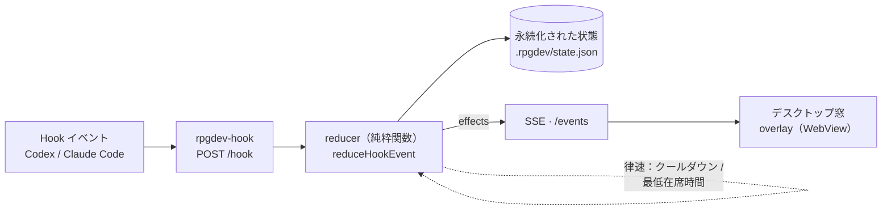

<p align="center">
  
</p>

# RPGDev

[English](README.md) · **日本語**

[](https://www.npmjs.com/package/rpgdev)
[](https://github.com/kitepon-rgb/rpgdev/actions/workflows/ci.yml)


Codex CLI / Claude Code が出す **Hook イベント**を、小さな RPG 風デスクトップ窓の演出に変換するアプリです（macOS / Windows / WSL2 対応）。ツール使用が戦闘アクションに、TODO リストがクエストログに、精霊が仲間として参戦します。**遊ぶのではなく、コードを書くだけ**——デスクトップの小窓で冒険が勝手に進みます。

<p align="center">
  
</p>
<p align="center"><sub>実際のオーバーレイ窓（戦闘中）— 上部にクエストログ、HP 付きの敵、勇者＋精霊、<b>ダンジョン</b>ステージ。作業に合わせてリアルタイムに動きます。</sub></p>

## 30秒で何が起きるか

Claude Code / Codex で作業を始めると、RPGDev のフックが全イベントを小窓に流します。

- **プロンプトを送る** → 冒険開始、**草原（field）**へ。
- エージェントが**ツールを使う** → 約20%で**モンスターがエンカウント**。出なければ前進。
- エージェントが**ツール呼び出しを終える** → 勇者がツール名のスキル攻撃（`Edit`・`Bash`・`Grep`…）。
- **TODO リスト**（`TodoWrite` / `update_plan`）が画面の**クエストログ**に。TODO 完了が紐づく敵の討伐になる。
- サブエージェントが**精霊の仲間**を呼び、ツール失敗で敵が**反撃**。
- TODO が進むと **草原 → 洞窟 → 城** とステージが進み、背景と BGM が切り替わる。

多数のエージェントを同時に走らせてもチラつきません——サーバが時刻で律速します（[仕組み](#仕組み)）。

## インストール — AI エージェントに頼むだけ

一番簡単なのは **AI コーディングエージェントに頼む**ことです。Claude Code か Codex にこう言ってください：

> **https://github.com/kitepon-rgb/rpgdev を見て RPGDev をインストールして。**

エージェントが [docs/agent-install.md](docs/agent-install.md) に従って、パッケージ導入・フックの**安全な自動書込**（バックアップ＋アトミック＋冪等＝既存設定を壊さない）・Windows/WSL2 のファイアウォール許可・窓の起動まで行います。**管理者が要る1手（WSL2 の Windows 側ファイアウォール）だけ**あなたに頼みます。

手動でやる場合:

```bash
npm install -g rpgdev
rpgdev setup --apply        # フックを安全に書込（無理なら書かずに表示へフォールバック）
rpgdev setup-firewall       # Windows/WSL2 のみ・Windows 側で実行
rpgdev setup-shortcut       # Windows/WSL2 のみ・スタートメニューに登録（Aqua の顔アイコン）
rpgdev                      # 窓を開く
```

`rpgdev help` でオプション（`--codex` / `--all` / `--user` …）を確認できます。

## 出会える総勢

モンスターは TODO 項目ではなく**ランダムエンカウント**——3ステージ計15体、加えて勇者と4体の精霊。

<p align="center">
  
</p>

### アートは“ストック画像”ではなく“鍛造”

スプライトはすべて **[sprite-forge](https://github.com/kitepon-rgb/sprite-forge-mcp)** で生成しています——このゲームのために作られた、ローカル [ComfyUI](https://github.com/comfyanonymous/ComfyUI) のスプライト工房。人間でも AI エージェント（MCP 経由）でも駆動でき、透過のゲーム用スプライトをきれいに出します。たとえばこの Magma Golem も一発生成です：

<p align="center">
  
</p>

## 特徴

- **ランダムエンカウント** — モンスターは TODO 項目から湧かない。ツール使用ごと（`PreToolUse`・約20%）に最大1体出現。スプライトと HP はステージ別カタログから（草原：Slime / Goblin / Orc / Ogre、洞窟・城は専用名簿。Dragon・Demon Lord は城の終盤だけ）。
- **TODO 駆動のクエスト** — TODO 一覧（Claude `TodoWrite` / Codex `update_plan`）を画面上部のクエストログに表示。TODO 完了が紐づくエンカウントの討伐トリガーになる。
- **精霊の仲間** — 最大4体が参戦（Ignis / Terra / Sylph / Aqua = 火 / 地 / 風 / 水）。勇者のスキル攻撃のあとに追撃し、被弾を重ねると退場。`SubagentStart` / `SubagentStop` で参戦・帰還。
- **失敗で反撃** — ツール失敗で敵が反撃（Claude は `PostToolUseFailure` / `PermissionDenied` で検知。Codex は hook が成否を出さないため反撃なし）。
- **ステージと BGM** — TODO の進捗で 草原 → 洞窟 → 城 と進み、背景と7種のオリジナル JRPG 調 BGM が切り替わる。
- **多エージェント安全** — 1台に大量のエージェントをぶつけても、サーバが出現を律速し、作業中のクエストを保護して横取り・上書きを防ぐ。
- **Codex / Claude Code 両対応** — 1セットのフック・1つのサーバ・2プロバイダ。

## 3つのステージ、ひとつの冒険

TODO 一覧は3区画に均等割りされ、達成するほど背景（と BGM）が奥へ進みます。

<p align="center">
  
</p>

## 討伐条件

討伐条件は、敵が出現した瞬間に「進行中の TODO があったか」で固定されます。

- **出現時に進行中 TODO 無し** → 勇者のスキル攻撃（`PostToolUse`）**5回**、またはターン終了で討伐。
- **出現時に進行中 TODO あり** → その項目に*紐づき*、攻撃では倒せない。TODO が1つ `completed` になった瞬間、またはターン終了で討伐。

**ターン終了（街に戻る）は、そのセッションの未完了 TODO が無くなったとき（またはセッション終了時）だけ**で、応答のたびではありません。本物の TODO が残っている間はクエストはそのセッションのもので、別セッションに奪われません。HP は演出専用です。

## 動作環境

- Node.js 20+（全プラットフォーム共通）
- **macOS** — Swift compiler / Xcode Command Line Tools（窓は `swiftc` で必要時コンパイル）
- **Windows** — WebView2 ランタイム（Windows 11 標準）＋ .NET Framework 4.x の `csc.exe`（窓は C# WinForms+WebView2 を必要時コンパイル）。WebView2 SDK DLL は同梱済み（追加 DL 不要）。詳細は [docs/windows-wsl.md](docs/windows-wsl.md)
- **WSL2** — ハブ（サーバ）も窓も Windows ホスト側で動き（interop 起動）、WSL2 は単一の共有ハブへ接続。ホストに Node＋WebView2 と、WSL→ホスト inbound を許すファイアウォール許可（`rpgdev setup-firewall` が標準 Defender＋Hyper-V の両層を適用）が必要。詳細は [docs/windows-wsl.md](docs/windows-wsl.md)
- **素の Linux** — デスクトップ窓は未対応。ブラウザ表示（`npm run web`）を使用

## 起動

```bash
rpgdev
```

デスクトップに小さい RPGDev 窓が開きます（macOS / Windows。WSL2 では Windows ホスト側に表示）。状態やログは実行プロジェクトの `.rpgdev/` に保存。Windows/WSL2 の詳細は [docs/windows-wsl.md](docs/windows-wsl.md)。

**Windows / WSL2 では、窓と一緒にタスクトレイ常駐（Aqua の顔アイコン）も起動します。** これはハブが動いている目印で、消えれば停止です（新しいトレイアイコンは Windows 既定で `^` のあふれメニューに隠れます）。右クリックで「窓を開く」「街に戻る」「終了（ハブ停止）」。

Web 版だけを開く場合:

```bash
rpgdev-server --open    # http://127.0.0.1:37373/
```

## フックの設定

RPGDev は Hook イベントで動くので、AI エージェントに `rpgdev-hook` を呼ぶ設定を入れます。

**一番かんたん — AI エージェントに任せる。** すでに開いているエージェントにこう頼むだけ:

> RPGDev のフックを設定して（`node_modules/rpgdev/docs/install-hooks.md` に従って）。

エージェントが `rpgdev setup` を実行して、この端末向けの正しい設定を取得し、**既存設定を壊さずに**マージします。RPGDev 自身は設定ファイルを書き換えません——適用はあなたのエージェントが目の前で行います。手順書: [docs/install-hooks.md](docs/install-hooks.md)。

**手動でやる場合。** `rpgdev setup`（Codex は `--codex` / 両対応は `--all`、パソコン全体は `--user`）を実行し、表示された JSON を**表示されたパスにそのまま**コピーします。書き込み先はスコープで変わります：プロジェクト用は `.claude/settings.local.json`、パソコン全体（`--user`）の Claude は `~/.claude/settings.json`（ユーザー全体の `settings.local.json` は Claude Code に読まれません）。

```bash
rpgdev setup            # Claude Code 用の設定と置き場所を表示
rpgdev setup --all      # Claude Code と Codex の両方
```

表示される設定は node 実体＋同梱フックスクリプトの絶対パスで呼ぶ形なので、macOS / Windows / WSL2 のどれでも動きます（PATH や `.cmd` シムの罠なし）。新しく足したフックは**新しいセッションで反映**されます。

### Hook → アクション対応表

| Hook | 何が起きるか |
| --- | --- |
| `UserPromptSubmit` | 冒険開始・窓を開く・草原へ（クエスト進行中の続き入力は前進のみ＝やりかけの TODO 一覧は保持され、上書きされない） |
| `PreToolUse` | 20% でエンカウント出現、戦闘中は 20% で精霊増援、出なければ前進（**攻撃しない**） |
| `PostToolUse` | `TodoWrite` / `update_plan` はクエスト更新；他のツールは勇者の**スキル攻撃**（技名＝ツール名を整形）。精霊もこの時だけ追撃 |
| `PostToolUseFailure` / `PermissionDenied`（Claude のみ） | 敵が反撃 |
| `SubagentStart` / `SubagentStop` | 精霊が参戦 / 帰還（FIFO＝最初に出た仲間から） |
| `Stop` | **クエストの TODO が終わったとき**だけターン終了——在席エンカウントを討伐し街へ戻る |

Hook がサーバへ送れない場合は静かに成功扱いせず、stderr と `.rpgdev/hook-errors.log` にエラーを出して非ゼロ終了します。

## 仕組み

RPGDev は厳密な**一方向パイプライン**——ゲームロジックは reducer 1か所だけ。



1. **Hook CLI**（`rpgdev-hook <provider> <event>`）が Hook ペイロードを stdin から読み、サーバ起動を確認して `/hook` に POST。
2. **サーバ**（`node:http`・npm 依存ゼロ）が reducer を実行し、永続化して SSE で配信。
3. **Reducer**（`server/adventure-state.mjs`）は I/O 無しの純粋関数 `reduceHookEvent(prevState, hookEvent, now) → { state, effects }`。**唯一の信頼できる情報源**＝唯一のユニットテスト対象で、アプリの心臓部。UI はゲームロジックを計算せず、配信された `effects` に反応するだけ。
4. **UI** — オーバーレイ（`public/overlay.js`）を載せたデスクトップ窓：macOS は Swift `WKWebView`、Windows / WSL2 は C# WinForms+WebView2（`scripts/desktop.mjs` がプラットフォーム分岐）。加えて補助のフル Web ビュー `/`。どちらも `/events` を `EventSource` で購読。

reducer は**唯一の時計**でもあり、出現クールダウンと最低在席時間で、多数のエージェントがイベントを溢れさせても画面を落ち着かせます（モンスターが点滅しない）。

## アセット / BGM

- 背景: `public/assets/town.png`（街）/ `field.png`・`dungeon.png`・`castle.png`（探索）/ `title.png`（トランジション一枚絵）
- 勇者: `public/assets/sprites/hero.png` ほか（`hero-relax.png` / `hero-battle.png`）
- モンスター（草原）: `slime` / `goblin` / `orc` / `ogre`　（洞窟）: `skeleton` / `ghoul` / `witch` / `grim-reaper` / `succubus`　（城）: `dullahan` / `dragon` / `demon-lord` / `dark-mage` / `wolf-beastwoman` / `dark-knight`
- 精霊: `ally-fire` / `ally-earth` / `ally-wind` / `ally-water-facing-slit`（残ライフ3以下は `*-damaged` に差し替え）
- BGM（7トラック）: `field` / `adventure` / `battle` / `dungeon-*` / `castle-*`。`scripts/render-bgm.mjs` から生成（オリジナルのクラシック JRPG 調）。効果音は `scripts/render-sfx.mjs`。`monster-appear.wav` / `monster-defeat.wav` は別アセットで再生成されない。
- フォント: `public/fonts/cinzel.woff2`（トランジションのタイトル文字・自己ホスト・OFL）

## 開発

```bash
npm test                 # node:test スイート（reducer のテスト）
npm start                # ビルド＋デスクトップ窓を起動
npm run server           # HTTP サーバのみ
npm run web              # サーバ＋フル Web ビュー
npm run build:desktop    # 窓のコンパイルのみ（macOS=Swift / Windows・WSL2=C#）
npm run demo             # 起動中サーバへ擬似 Hook を流す
npm run trace            # .rpgdev/ のログから演出トレースを解析
npm run render:bgm       # BGM(7トラック)を再生成
npm run render:sfx       # 攻撃/帰還の効果音を再生成
```

ビルド/バンドル工程も TypeScript も無く、全体が**依存ゼロの素の ESM**（stdlib のみ）。BGM/SFX は決定的に生成される WAV——音声を直接編集せず、ジェネレータを直してから再生成してください。設計の正典は [docs/design-todo-rpg.md](docs/design-todo-rpg.md)（reducer を触る前に必読）。

## License

[MIT](LICENSE)
