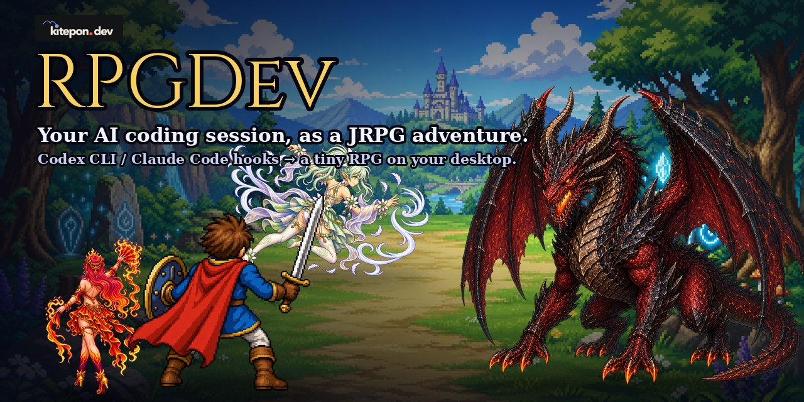
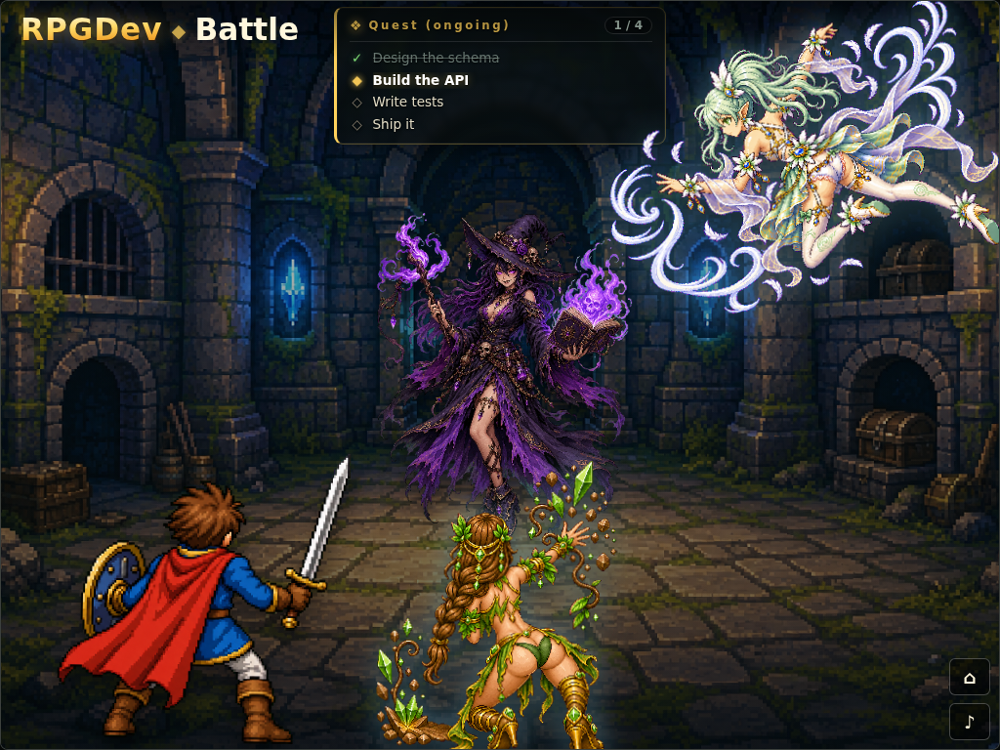
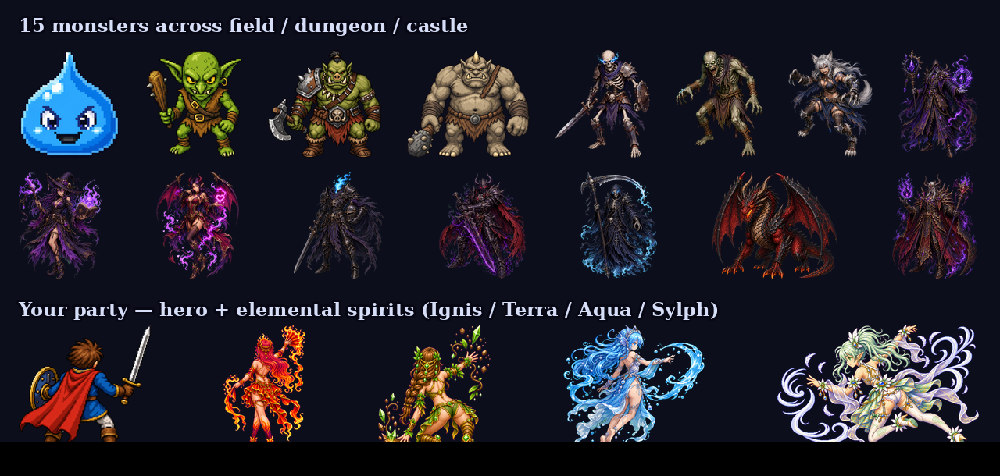
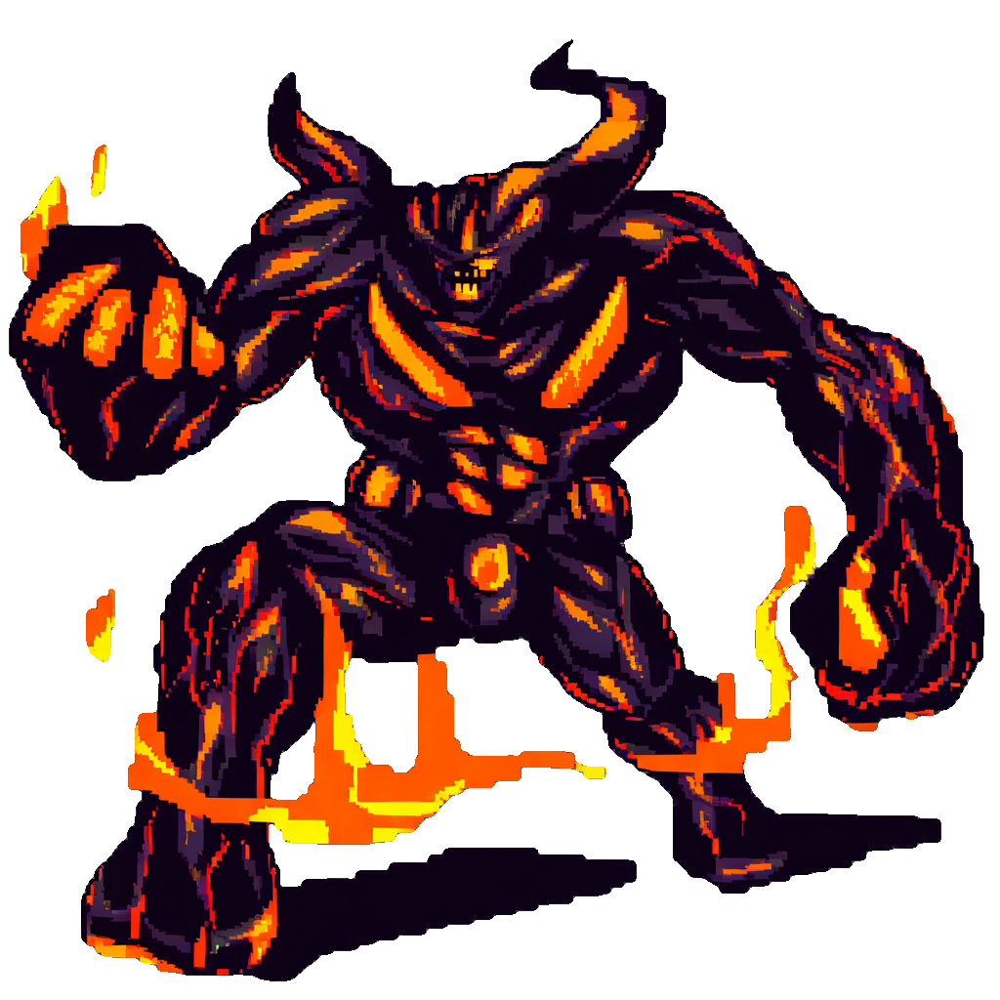
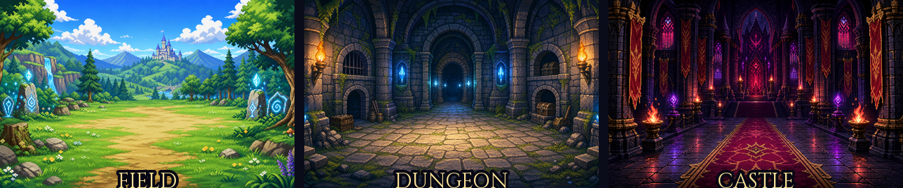
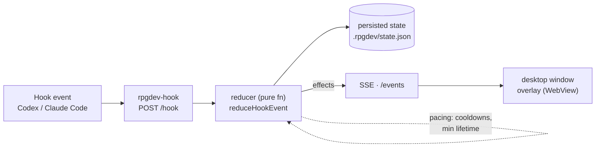

<p align="center">
  
</p>

# RPGDev

> Turn your Codex CLI / Claude Code hook events into a tiny RPG playing out on your desktop (macOS, Windows, WSL2).

**English** · [日本語](README.ja.md)

[](https://www.npmjs.com/package/rpgdev)
[](https://github.com/kitepon-rgb/rpgdev/actions/workflows/ci.yml)


RPGDev is a small desktop overlay that turns the **hook events** your AI coding agent emits — Codex CLI and Claude Code — into a classic JRPG-style scene. Every tool call becomes a battle action, your TODO list becomes a quest log, and elemental spirits join you as allies while you work. **You don't play it — you just code, and watch the adventure unfold** in a little window on your desktop.

<p align="center">
  
</p>
<p align="center"><sub>The real overlay window, mid-battle — quest log up top, an encounter with its HP, your hero + elemental spirits, on the <b>dungeon</b> stage. It reacts in real time as you work.</sub></p>

## 30 seconds: what actually happens

You start a task in Claude Code or Codex. RPGDev's hooks feed every event into a little window:

- You **send a prompt** → the adventure begins, you arrive in the **field**.
- Your agent **uses a tool** → ~20% of the time a **monster appears** (random encounter); otherwise you press on.
- Your agent **finishes a tool call** → your hero lands a **skill attack** named after the tool (`Edit`, `Bash`, `Grep`…).
- Your **TODO list** (`TodoWrite` / `update_plan`) becomes the on-screen **quest log**; completing a TODO can be what defeats a linked monster.
- Subagents spawn **elemental spirit allies**; a failing tool call lets the enemy **counter-attack**.
- As your TODOs progress, the scene advances **field → dungeon → castle**, swapping the background art and the BGM.

It runs many agents at once without flicker — the server paces everything (see [How it works](#how-it-works)).

## Install — just ask your AI agent

The easiest way is to **tell your AI coding agent to install it.** In Claude Code or Codex, say:

> **Read https://github.com/kitepon-rgb/rpgdev and install RPGDev for me.**

Your agent follows [docs/agent-install.md](docs/agent-install.md): it installs the package, writes the
hooks into your settings **safely** (backs up, atomic, idempotent — it never clobbers your existing
config), opens the host firewall on Windows/WSL2, and launches the window. The scripts do the work; the
agent only asks you for the one admin-only step (the Windows firewall, when you're on WSL2).

Prefer to do it by hand?

```bash
npm install -g rpgdev
rpgdev setup --apply        # write the hooks (safe; refuses if it can't do it safely)
rpgdev setup-firewall       # Windows/WSL2 only — run on the Windows host
rpgdev setup-shortcut       # Windows/WSL2 only — add a Start Menu entry (Aqua-face icon)
rpgdev                      # open the window
```

Run `rpgdev help` for options (`--codex`, `--all`, `--user`, …).

## A whole roster to meet

Monsters are **random encounters**, not your TODO items — fifteen of them across the three stages, plus your hero and four elemental spirits.

<p align="center">
  
</p>

### The art is forged, not stock

Every sprite is generated with **[sprite-forge](https://github.com/kitepon-rgb/sprite-forge-mcp)** — a local [ComfyUI](https://github.com/comfyanonymous/ComfyUI) sprite studio (also by the author, built *for* this game) that a human or an AI agent can drive over MCP to make clean, transparent, game-ready sprites. This Magma Golem, for instance, was forged in one pass:

<p align="center">
  
</p>

## Features

- **Random encounters** — Monsters aren't tied to TODO items. They appear on every tool use (`PreToolUse`, ~20% chance), at most one at a time. Sprite and HP come from a stage-specific catalog (field: Slime / Goblin / Orc / Ogre; dungeon and castle have their own rosters; the Dragon and Demon Lord only show up in the castle's final stretch).
- **TODO-driven quests** — Your TODO list (Claude `TodoWrite` / Codex `update_plan`) is shown as an on-screen quest log. Completing a TODO can be the trigger that defeats a linked encounter.
- **Elemental spirit allies** — Up to four spirits join the fight (Ignis / Terra / Sylph / Aqua = fire / earth / wind / water), follow up after the hero's skill attacks, and retire after taking enough hits. `SubagentStart` / `SubagentStop` bring allies in and out.
- **Counter-attacks on failure** — When a tool fails, the enemy strikes back (Claude detects this via `PostToolUseFailure` / `PermissionDenied`; Codex hooks don't report tool success/failure, so no counter there).
- **Adventure stages with BGM** — As your TODOs progress, the scene advances field → dungeon → castle, swapping background art and one of seven original JRPG-style BGM tracks.
- **Multi-agent safe** — Run a swarm of agents against one machine; the server paces spawns and protects an in-progress quest so it isn't overwritten mid-flight.
- **Works with both Codex and Claude Code** — One set of hooks, one server, two providers.

## Three stages, one adventure

Your TODO list is split evenly across three stages; the scene (and the BGM) advances as you complete them.

<p align="center">
  
</p>

## How defeat works

The win condition is fixed the moment a monster appears, based on whether a TODO was in progress:

- **No `in_progress` TODO at spawn** → defeat with **5 hero skill attacks** (`PostToolUse`), or when the turn ends.
- **An `in_progress` TODO at spawn** → the encounter is *linked*; attacks can't kill it. It falls when one TODO becomes `completed`, or when the turn ends.

A **turn ends** (you return to town) only when the owning session has **no unfinished TODOs left** (or its session ends) — not on every reply. While real TODOs are still open, the quest stays yours and can't be claimed by another session. HP is purely for show.

## Requirements

- Node.js 20+ (all platforms)
- **macOS** — Swift compiler / Xcode Command Line Tools (the window is compiled on-demand with `swiftc`)
- **Windows** — WebView2 Runtime (preinstalled on Windows 11) + .NET Framework 4.x `csc.exe` (the window is a C# WinForms + WebView2 host, compiled on-demand). The WebView2 SDK DLLs are bundled, so no extra download. See [docs/02_windows-wsl.md](docs/02_windows-wsl.md).
- **WSL2** — the hub server and the window both run on the Windows host (started via interop); WSL2 connects to a single shared hub. Needs Node + WebView2 on the host and a host firewall allow for WSL→host traffic (applied by `rpgdev setup-firewall` — a standard Defender rule plus a Hyper-V rule). See [docs/02_windows-wsl.md](docs/02_windows-wsl.md).
- **bare Linux** — no desktop window yet; use the browser view (`npm run web`).

## Quick start

```bash
rpgdev
```

A small RPGDev window opens on your desktop (macOS / Windows; on WSL2 it appears on the Windows host). Runtime state and logs are written per-project under `.rpgdev/`. Windows/WSL2 setup details: [docs/02_windows-wsl.md](docs/02_windows-wsl.md).

On **Windows / WSL2** a small **task-tray icon** (the Aqua water-spirit's face) also appears alongside the window — its presence means the hub is running, and it disappears when the hub stops. Right-click it to open the window, return to town, or quit (which stops the hub). Windows hides new tray icons under the overflow (`^`) by default, so look there if you don't see it.

To open just the web view instead of the native window:

```bash
rpgdev-server --open    # http://127.0.0.1:37373/
```

## Hooks setup

RPGDev is fed by hook events, so your coding agent needs a few hook entries pointing at `rpgdev-hook`.

**Easiest — let your AI agent do it.** You already have one open; just ask:

> Set up RPGDev hooks for me (follow `node_modules/rpgdev/docs/install-hooks.md`).

It runs `rpgdev setup` to get the exact config for your machine and merges it into your settings
**without touching anything else**. RPGDev never edits your files itself — your agent does, in front of
you. Recipe: [docs/install-hooks.md](docs/install-hooks.md).

**By hand.** Run `rpgdev setup` (add `--codex` or `--all` for Codex, `--user` for the machine-wide
config) and copy the printed JSON into the **exact file it prints**. The target differs by scope:
project hooks go in `.claude/settings.local.json`, but machine-wide (`--user`) Claude hooks go in
`~/.claude/settings.json` (a user-level `settings.local.json` is not read by Claude Code). `rpgdev
setup` prints the right path for you.

```bash
rpgdev setup            # prints the Claude Code config + where to put it
rpgdev setup --all      # both Claude Code and Codex
```

The printed config runs the hook via an absolute path to node + the installed hook script, so it works
on macOS, Windows, and WSL2 alike (no `PATH` / `.cmd`-shim surprises).

> **Reference configs:** [`examples/`](examples/) holds static snapshots for manual copying (they
> assume a global install). Prefer `rpgdev setup`, which writes the more robust absolute-path form.

### Hook → action map

| Hook | What happens |
| --- | --- |
| `UserPromptSubmit` | Start the adventure, open the window, head to the field (a follow-up prompt while your quest is still in progress just advances — the in-progress TODO list is kept, not overwritten) |
| `PreToolUse` | 20% chance to spawn an encounter; in battle, 20% chance an ally joins; otherwise advance (no attack) |
| `PostToolUse` | `TodoWrite` / `update_plan` update the quest log; any other tool is a hero **skill attack** (move name = the tool name, formatted) — allies follow up here too |
| `PostToolUseFailure` / `PermissionDenied` *(Claude only)* | The enemy counter-attacks |
| `SubagentStart` / `SubagentStop` | An ally spirit joins / returns (FIFO — first in, first out) |
| `Stop` | End of turn **once the quest's TODOs are done** — any present encounter is defeated and you return to town |

If the hook CLI can't reach the server it does **not** silently succeed — it logs to stderr and `.rpgdev/hook-errors.log` and exits non-zero.

## How it works

RPGDev is a strict **one-way pipeline** — the reducer is the only place game logic lives:



1. **Hook CLI** (`rpgdev-hook <provider> <event>`) reads the hook payload from stdin, ensures the server is up, and POSTs it to `/hook`.
2. **Server** (`node:http`, zero npm dependencies) runs the reducer, persists the result, and broadcasts over SSE.
3. **Reducer** (`server/adventure-state.mjs`) is a pure function, `reduceHookEvent(prevState, hookEvent, now) → { state, effects }`, with no I/O. **It is the single source of truth** — the only unit-tested module, and the heart of the app. The UI never computes game logic; it just reacts to the broadcast `effects`.
4. **UI** — a desktop window hosting the overlay (`public/overlay.js`): a Swift `WKWebView` on macOS, a C# WinForms + WebView2 host on Windows / WSL2 (`scripts/desktop.mjs` dispatches per platform). Plus a secondary full web view at `/` (`public/app.js`). Both subscribe to `/events` via `EventSource`.

The reducer is also the **only clock**: spawn cooldowns and minimum on-screen lifetimes keep the scene calm even when many agents flood it with events, so monsters never flicker in and out.

## Development

```bash
npm test                 # run the node:test suite (the reducer's tests)
npm start                # build + launch the desktop window (per platform)
npm run server           # HTTP server only (no window)
npm run web              # server + open the full web view
npm run build:desktop    # compile the desktop window only (Swift on macOS, C# on Windows/WSL2)
npm run demo             # replay a synthetic hook sequence against a running server
npm run trace            # analyze effect traces from .rpgdev/ logs
npm run render:bgm       # regenerate the 7 BGM tracks
npm run render:sfx       # regenerate attack / return SFX
```

There is **no build/bundle step and no TypeScript** — the whole project is plain ESM with **zero runtime npm dependencies** (stdlib only). BGM and SFX are deterministically generated WAVs; edit the generators, then re-run `render:bgm` / `render:sfx` rather than editing the audio directly.

Documentation starts at [docs/00_overview.md](docs/00_overview.md). The full design rationale and real-world hook verification notes live in [docs/01_design-todo-rpg.md](docs/01_design-todo-rpg.md) — read it before touching the reducer.

## License

[MIT](LICENSE)
